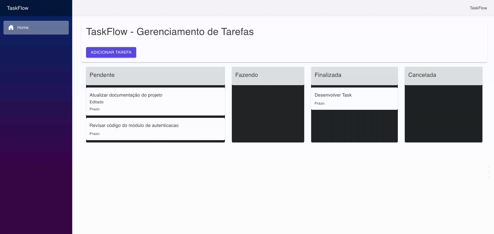
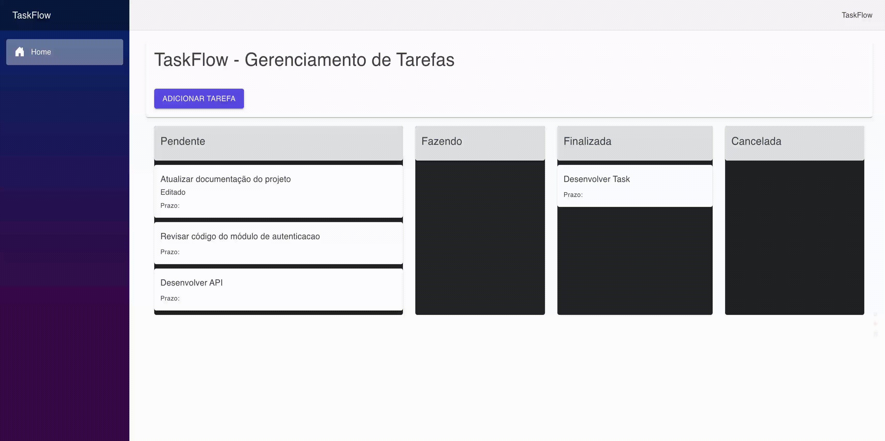
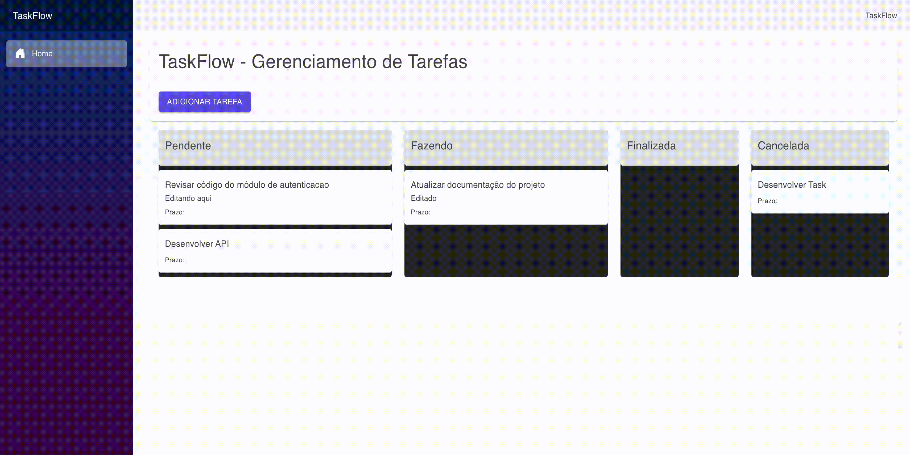
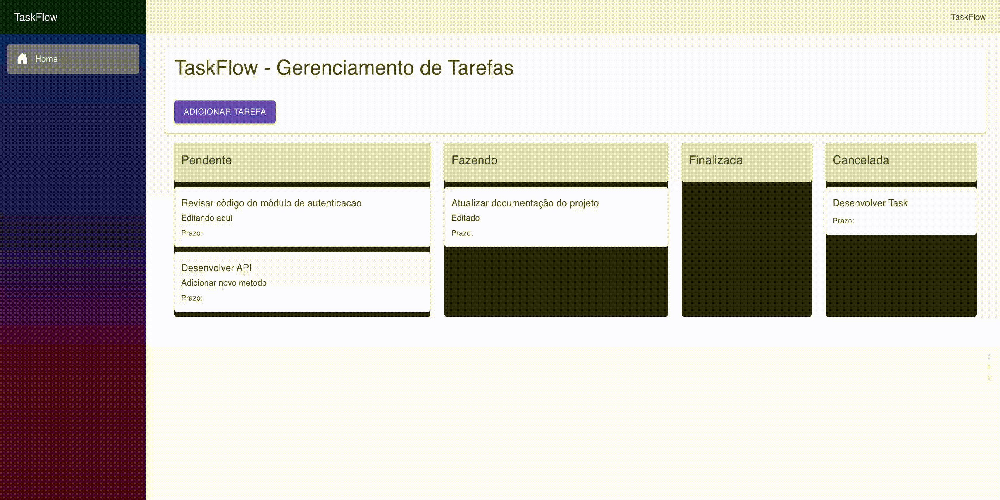

# 🗂️ TaskFlow – Gerenciador de Tarefas Kanban

O **TaskFlow** é uma aplicação web para gerenciamento de tarefas no formato **Kanban**, focada em organização visual, fluidez na interação e separação clara entre interface, regras de negócio e persistência de dados.

A aplicação permite acompanhar o ciclo das tarefas de forma direta, utilizando um fluxo baseado em estados que facilita a visualização do progresso.

---

## ✨ Funcionalidades

- Quadro Kanban com movimentação de tarefas entre colunas (drag and drop)
- Criação, edição e exclusão de tarefas
- Visualização detalhada em modal
- Organização por status:
  - Pendentes
  - Em andamento
  - Finalizado
  - Cancelado

---

## 📸 Demonstração

### ➕ Adicionar tarefa


### 🔄 Mover tarefa


### ✏️ Editar tarefa


### ❌ Remover tarefa


---

## 🔭 Direção do Produto

O TaskFlow está sendo expandido para se tornar uma ferramenta mais completa de organização pessoal, incluindo:

- Criação de categorias personalizadas
- Autenticação e perfil de usuário
- Histórico de tarefas com visualização por data
- Filtros personalizados
- Registro de anotações e ideias
- Controle de tempo por tarefa
- Espaço dedicado ao planejamento detalhado de atividades

---

## 🖥️ Visão Geral

A aplicação é composta por um front-end interativo integrado a uma API responsável pela lógica de negócio e persistência dos dados.

Fluxo principal:

- Criação e edição de tarefas via interface
- Persistência dos dados na API
- Atualização do quadro Kanban em tempo real
- Movimentação de tarefas entre estados

---

## 🏗️ Arquitetura

O projeto está estruturado em camadas bem definidas:

- **Client**  
  Aplicação em **Blazor WebAssembly**, responsável pela interface

- **API**  
  ASP.NET Core responsável pelos endpoints e orquestração das operações

- **Application**  
  Camada de regras de negócio

- **Domain**  
  Entidades e definições centrais do sistema

- **Infrastructure**  
  Persistência de dados, acesso ao banco e repositórios

- **Shared**  
  DTOs e contratos utilizados entre client e server

---

## 🛠️ Tecnologias

- ASP.NET Core Web API
- Blazor WebAssembly
- Entity Framework Core
- SQL Server
- C#
- MudBlazor

---

## 🚀 Como executar

### Pré-requisitos

- .NET SDK instalado
- SQL Server (local ou container)

### Passos

```bash
git clone https://github.com/rennansilva16/task-flow.git
````

1. Abra a solução no seu editor
2. Configure a string de conexão no projeto **API**
3. Execute a API
4. Execute o projeto **Client**

---

## 📌 Status

Aplicação funcional com gerenciamento de tarefas via interface Kanban.

---

## 👤 Autor

**Rennan Silva**
GitHub: [https://github.com/rennansilva16](https://github.com/rennansilva16)
